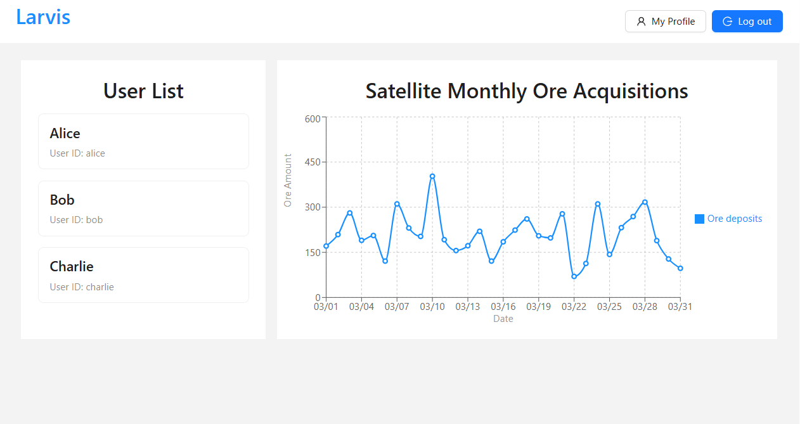

# Larvis home assignment project

This project contains all the code for LARVIS home assignment

## Directories

- `larvis-service`: Contains provided backend Larvis service and the frontend assignment instruction running on port `8080`
- `larvis-ui`: Frontend Web application to interracti with Larvis service running on port `3000`

## Setup project environment with docker

The project is run in docker to keep the envirnment consistent across multiple machine.In order to run the project, you need to have docker installed in your local machine

### Run production build in Docker

Create a optimized build with Vite to `larvis-ui/dist` and run it in Docker with file `docker-compose.prod.yml`. Create the build by running the command below in root folder `larvis-project`

```
docker compose -f docker-compose.prod.yml up --build
```

After the initial build, you can start the project in the background next time with command

```
docker compose -f docker-compose.prod.yml up -d
```

You can stop all running container with command

```
docker compose down
```

If you encounter this error on Mac

```
Error response from daemon: OCI runtime create failed: container_linux.go:367: starting container process caused: exec: "/larvis": permission denied: unknown
```

Run

```
cd larvis-service && chmod +x larvis
```

### Local development environemnt in Docker

For local development, i make file `docker-compose.yml` which will run the project with hot reload so developer can edit and save code and it will update automatically. Run the command below for local development

```
docker compose up --build
```

After the initial build, you can start the project in the background next time with command

```
docker compose up -d
```

You can stop all running container with command

```
docker compose down
```

## How to use the Larvis UI

When all container is running, go to [http://localhost:3000/login](http://localhost:3000/login) to login into Larvis service using 3 default users `alice`, `bob`, and `charlie`, with the default password, `1234`, other wise you can't use the service and well be redirect to `http://localhost:3000/login`

### Larvis UI

The Larvis homepage should look like this:


There are 3 main component

- There is a Navigation Bar on top that allow user to edit their own data by clicking `My Profile` and `Log out` button to log out of the service.

- There is a `User List` that display all the user in the service. We can see the user information by clicking on the user, if the user is the same as logged in user then we can edit the user information.

- There is a `Satellite Monthly Ore Acquisitions` that display the amount of ore deposited to the satellite everyday from last month

## Report for Larvis improvement

- The Time series data for `/acquisitions` is not sorted from backend. If this is production with heavy data, Sorting at the database level (e.g., SQL ORDER BY timestamp DESC) is much faster than the client and the backend service also has more resources, also we can optimize it by caching the result rather then rely on JS to sort it in client side.
